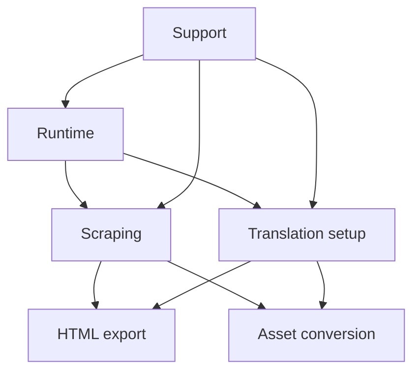

# Paraverse Module Translator Docs

This `docs` folder is now a blueprint for a future generated `src/` tree.

Each markdown file is named after the code file it is meant to generate later. The `.md` suffix only means "design contract"; the base filename is the intended implementation filename.

## Planned Generated Source Tree

```text
src/
  runtime/
    main.js
    reviewWorkflow.js
  scraping/
    browserSession.js
    termDetector.js
    coursePipeline.js
  translation/
    htmlTranslator.js
    translatorClient.js
    pageObjectTranslator.js
  assets/
    assetResolver.js
    pdfToPptPipeline.js
  support/
    config.js
    fileUtils.js
```

## Blueprint Layout

```text
docs/
  README.md
  src/
    README.md
    runtime/
      README.md
      main.js.md
      reviewWorkflow.js.md
    scraping/
      README.md
      browserSession.js.md
      termDetector.js.md
      coursePipeline.js.md
    translation/
      README.md
      htmlTranslator.js.md
      translatorClient.js.md
      pageObjectTranslator.js.md
    assets/
      README.md
      assetResolver.js.md
      pdfToPptPipeline.js.md
    support/
      README.md
      config.js.md
      fileUtils.js.md
```

## Module Groups

- `runtime/` is the CLI timeline from login to export.
- `scraping/` is the Paraverse-facing browser automation and output assembly layer.
- `translation/` is the text-translation logic for HTML and provider calls.
- `assets/` is the PDF-to-PPTX conversion path.
- `support/` is the shared configuration and helper layer.



## Reading Order

1. `docs/src/README.md`
2. `docs/src/runtime/main.js.md`
3. `docs/src/scraping/termDetector.js.md`
4. `docs/src/scraping/coursePipeline.js.md`
5. `docs/src/translation/translatorClient.js.md`
6. `docs/src/translation/htmlTranslator.js.md`
7. `docs/src/assets/pdfToPptPipeline.js.md`
8. `docs/src/support/config.js.md`
