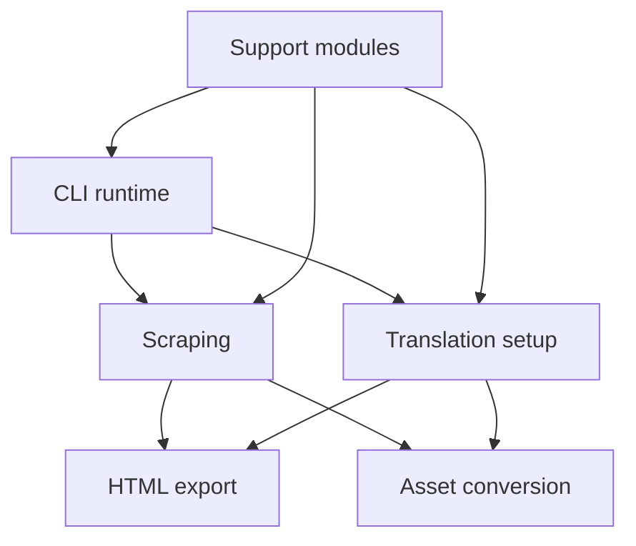

# `docs/src`

This directory should be read as the planned generated `src/` tree.

Each `*.js.md` file is the design contract for a future `*.js` implementation file. The goal is that the folder names and filenames already describe the code structure before any generation happens.

## Planned Source Tree

```text
src/
  runtime/
    main.js
    reviewWorkflow.js
  scraping/
    browserSession.js
    termDetector.js
    coursePipeline.js
  translation/
    htmlTranslator.js
    translatorClient.js
    pageObjectTranslator.js
  assets/
    assetResolver.js
    pdfToPptPipeline.js
  support/
    config.js
    fileUtils.js
```

## Folder Intent

- `runtime/` contains CLI-only coordination modules
- `scraping/` contains Paraverse session, term detection, and course scrape/export modules
- `translation/` contains translation-specific modules that do not know about Playwright
- `assets/` contains document and binary-asset processing modules
- `support/` contains configuration and shared file/path helpers

## Architecture At A Glance



## Reading Order

1. `runtime/README.md`
2. `runtime/main.js.md`
3. `scraping/README.md`
4. `scraping/termDetector.js.md`
5. `translation/README.md`
6. `translation/translatorClient.js.md`
7. `assets/README.md`
8. `support/README.md`
