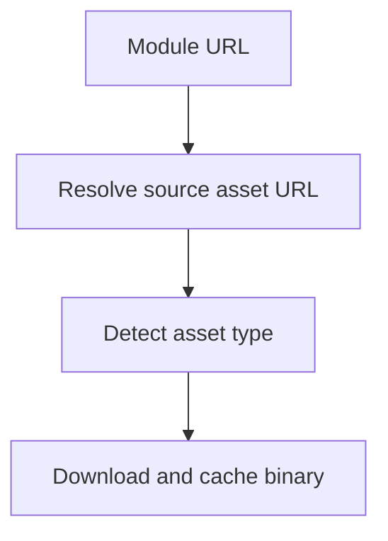

# `src/assets/assetResolver.js`

## Role

This file is the generated asset resolution and caching layer.

It should convert Paraverse module links into concrete asset records that the rest of the asset pipeline can consume.

## Planned Exports

- `extractSourceAssetUrl(moduleHref)`
- `detectAssetType(assetUrl)`
- `downloadBinary(requestContext, assetUrl)`
- `cacheAsset(requestContext, assetUrl, cacheFilePath)`

## Planned Responsibilities

- unwrap viewer URLs into direct source asset URLs
- detect whether the resolved asset is `pdf`, `ppt`, `pptx`, or unknown
- download authenticated binary content
- cache assets to disk for reuse across runs

## Control Flow

## Boundary

This module should not translate page text or generate slides. It only prepares stable asset inputs.
