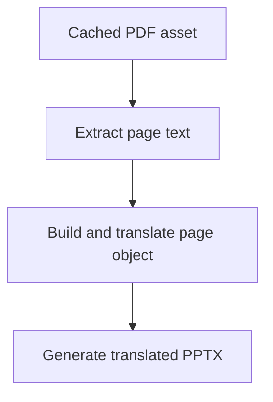

# `src/assets/pdfToPptPipeline.js`

## Role

This file is the generated PDF-to-PPT translation pipeline.

It should turn a cached PDF asset into translated page objects and a generated `.pptx` output.

## Planned Exports

- `extractPdfPagesText(pdfBuffer)`
- `buildPageObject(pages, keyName)`
- `buildTranslatedPagesFromObject(sourcePages, translatedPageObject)`
- `generateTranslatedPptFromPdf(options)`

## Planned Responsibilities

- extract normalized text from each PDF page
- convert page arrays into `PAGE n` objects
- call `pageObjectTranslator.js` for structured translation
- merge translated page text back onto source page records
- generate PowerPoint slides from the translated pages

## Control Flow

## Boundary

This module should consume resolved assets from `assetResolver.js`. It should not scrape Paraverse pages directly.
