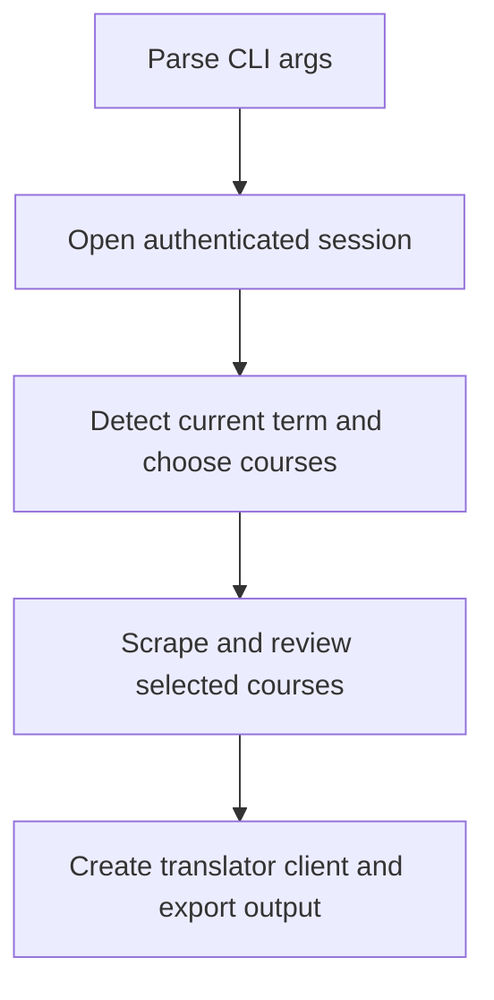

# `src/runtime/main.js`

## Role

This file is the generated CLI entrypoint.

It should own the runtime sequence from startup to export, but it should not contain scraper internals, provider request code, or file-format conversion logic.

## Planned Exports

- `main(argv)`
- `parseArgs(argv)`

## Planned Responsibilities

- load normalized runtime config
- open the authenticated browser session
- detect the current term
- let the user choose which courses to process
- run the review workflow before translation starts
- build the translator client factory
- hand the reviewed scrape set to the export pipeline

## Planned Dependencies

- `src/support/config.js`
- `src/scraping/browserSession.js`
- `src/scraping/termDetector.js`
- `src/scraping/coursePipeline.js`
- `src/runtime/reviewWorkflow.js`
- `src/translation/translatorClient.js`

## Control Flow

## Boundary

If a function needs detailed DOM scraping, provider-specific HTTP logic, or PDF conversion, it belongs in another module and `main.js` should call it instead of implementing it inline.
