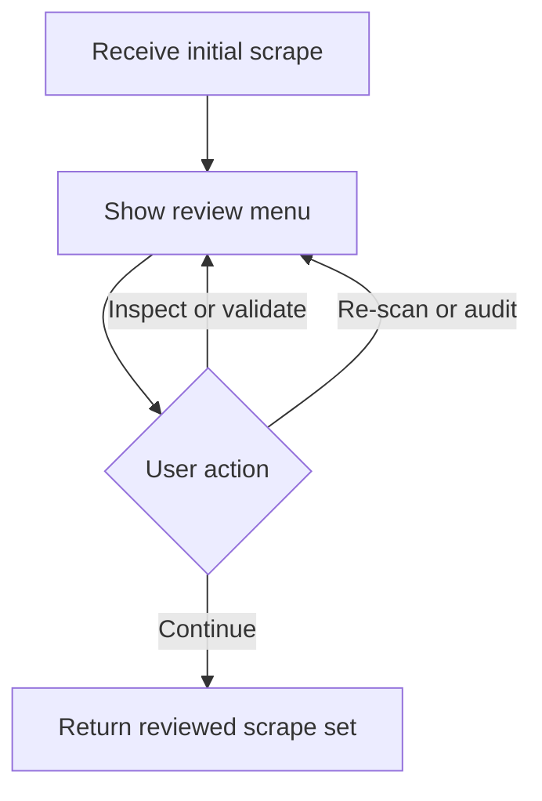

# `src/runtime/reviewWorkflow.js`

## Role

This file is the generated interactive review layer between scraping and export.

It should own user prompts, audit generation, and pre-export validation so `main.js` stays focused on orchestration.

## Planned Exports

- `chooseCoursesForScrape(courses, io)`
- `runReviewWorkflow(context, courses, initialScraped, options)`
- `askTranslationPreferences(defaults, io)`

## Planned Responsibilities

- present the detected current-term courses for selection
- print scrape summaries and detailed module lists
- validate expected module counts against discovered modules
- rerun strict or relaxed scans on demand
- generate a strict-vs-relaxed audit JSON file
- collect runtime translation preferences before export

## Control Flow

## Boundary

This module should not directly translate content or resolve module assets. It coordinates user decisions and delegates scrape work back to `coursePipeline.js`.
