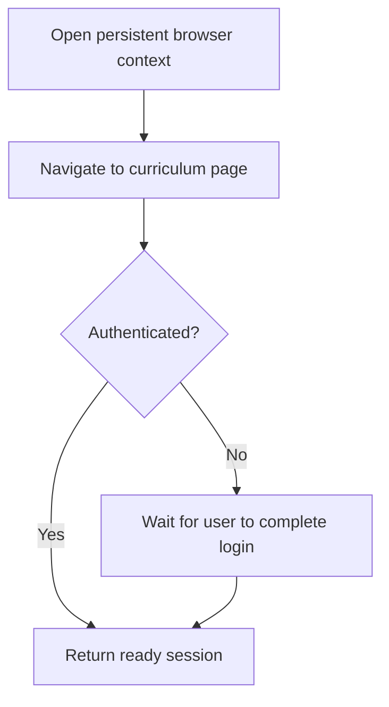

# `src/scraping/browserSession.js`

## Role

This file is the generated Playwright session layer for Paraverse access.

It should be the only place that knows how to open the persistent browser profile, wait for login, and guarantee that downstream scraping code starts from an authenticated state.

## Planned Exports

- `openBrowserSession(config)`
- `waitForAuthenticatedCurriculumPage(page, config)`

## Planned Responsibilities

- create the persistent Chromium context
- ensure session folders exist before launch
- navigate to the curriculum page
- detect whether SSO login is still in progress
- wait until the user has completed authentication

## Control Flow

## Boundary

This module should not decide the current term or scrape course/module data. It only returns a ready browser/session state.
