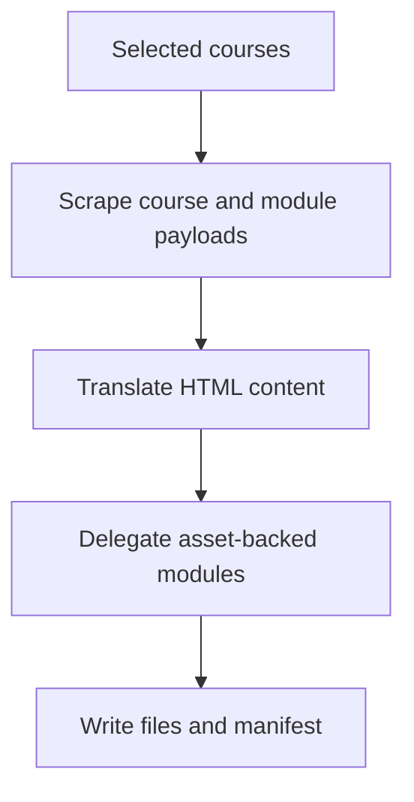

# `src/scraping/coursePipeline.js`

## Role

This file is the generated course-level scraping and export pipeline.

It should own the transition from selected courses to scraped module payloads, and from scraped payloads to translated HTML output and manifest records.

## Planned Exports

- `buildCourseMapUrl(curriculumUrl, courseCode, curriculumCode)`
- `buildModuleStubHtml(courseTitle, moduleTitle, moduleHref)`
- `scrapeCourses(context, courses, options)`
- `exportTranslatedCourses(outputDir, scrapedCourses, services, options)`

## Planned Responsibilities

- open each selected course map
- collect module rows from the course DOM
- resolve module resource URLs when the UI exposes them
- capture source HTML and fallback stub HTML
- translate course and module HTML through `htmlTranslator.js`
- delegate asset-backed modules to the asset pipeline
- write course output folders and the final manifest

## Control Flow

## Boundary

This module should not decide which term is current and should not own provider-specific translation prompts. It consumes those services from other modules.
