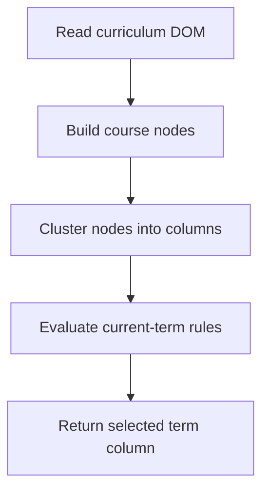

# `src/scraping/termDetector.js`

## Role

This file is the generated curriculum interpretation module.

It should convert the Paraverse curriculum view into structured course nodes and return the current term according to the selected student mode.

## Planned Exports

- `extractCourseNodes(page)`
- `clusterByColumn(nodes)`
- `detectCurrentTerm(columns, studentMode)`
- `detectCurrentTermForRegular(columns)`
- `detectCurrentTermForIrregular(columns)`

## Planned Responsibilities

- read course nodes from the curriculum DOM
- infer course code, status, and visual position
- group nodes into term-like columns
- mark each column with `allPassed` and `hasPending`
- return the first eligible current-term column for regular mode
- reserve a clean extension point for irregular mode

## Control Flow

## Boundary

This module should not open individual course pages or export files. It only decides which courses belong to the active term.
