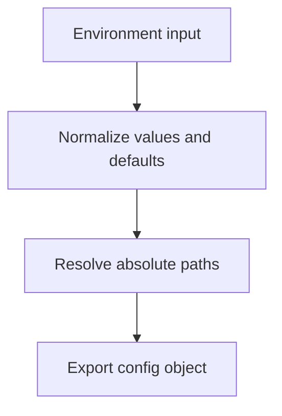

# `src/support/config.js`

## Role

This file is the generated runtime configuration module.

It should convert environment input into one normalized configuration object for the rest of the application.

## Planned Exports

- `config`
- `toBool(value, fallback)`

## Planned Responsibilities

- load environment variables
- apply defaults for URLs, provider settings, and output locations
- normalize booleans and path values
- expose a single config object to the runtime

## Control Flow

