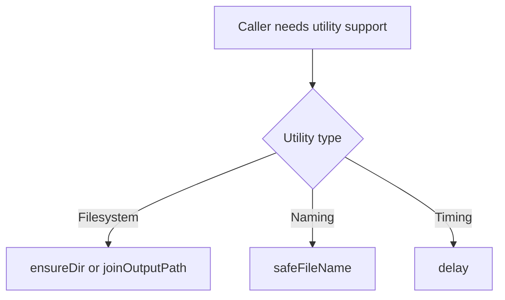

# `src/support/fileUtils.js`

## Role

This file is the generated shared utility module for path-safe and file-safe helpers.

It should contain the low-level helpers that multiple runtime, scraping, and asset modules need.

## Planned Exports

- `ensureDir(dirPath)`
- `safeFileName(value)`
- `delay(ms)`
- `joinOutputPath(baseDir, ...parts)`

## Planned Responsibilities

- create folders before writes happen
- sanitize course and module names for filesystem use
- provide async timing waits for browser automation
- build output-safe paths

## Control Flow

