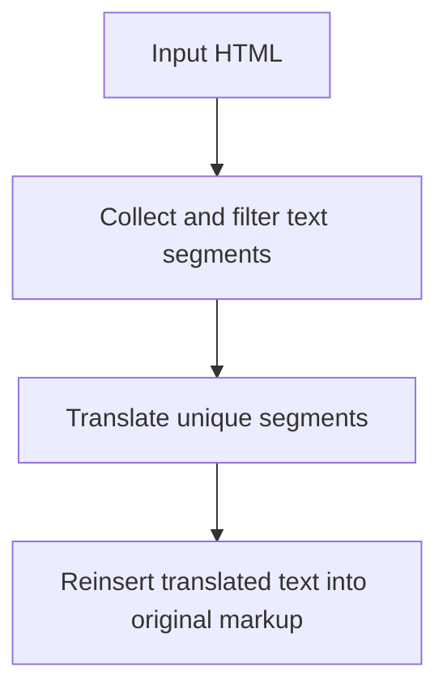

# `src/translation/htmlTranslator.js`

## Role

This file is the generated markup-preserving HTML translation module.

It should translate visible text while leaving the original HTML structure intact.

## Planned Exports

- `collectTextSegments(html)`
- `translateHtmlPreservingMarkup(html, translatorClient)`

## Planned Responsibilities

- identify visible text segments between tags
- ignore empty or low-signal fragments
- deduplicate repeated segments before translation
- replace text content without breaking markup

## Control Flow

## Boundary

This module should not make raw HTTP requests. It receives a translator client and uses that abstraction.
