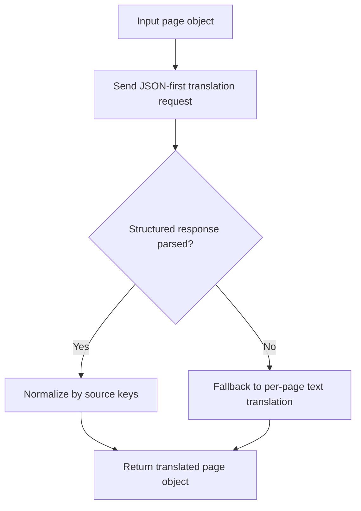

# `src/translation/pageObjectTranslator.js`

## Role

This file is the generated structured translation layer for page-based content.

It should translate `{ "PAGE n": "..." }` payloads while preserving the original keys so downstream document builders can trust the result.

## Planned Exports

- `translatePageObject(pageObject, translatorClient, options)`
- `tryParseJsonObject(raw)`
- `normalizeTranslatedPageObject(sourcePageObject, translatedCandidate)`

## Planned Responsibilities

- build the JSON-first translation prompt for page objects
- parse direct JSON or fenced JSON responses
- normalize output to the original `PAGE n` keys
- fall back to per-page plain-text translation when structured parsing fails

## Control Flow

## Boundary

This module depends on `translatorClient.js` for provider access. It should not write PPTX files or parse PDFs.
