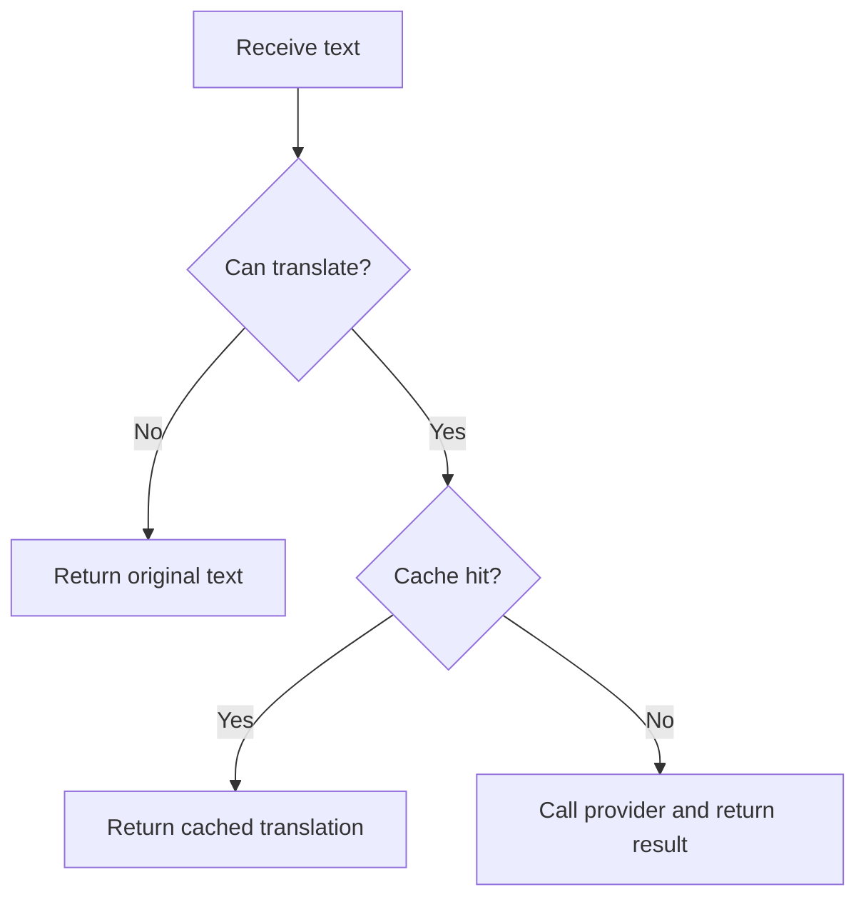

# `src/translation/translatorClient.js`

## Role

This file is the generated provider-facing translation client.

It should own API-key checks, endpoint selection, request formatting, and plain-text translation calls.

## Planned Exports

- `TranslatorClient`
- `createTranslatorClient(options)`

## Planned Responsibilities

- expose `canTranslate()`
- translate plain text with provider calls
- cache repeated plain-text translations when enabled
- resolve the correct chat-completions endpoint from provider settings
- provide a stable interface to higher-level translation modules

## Control Flow

## Boundary

This module should not know about HTML parsing or PDF page objects. It is the low-level translation client, not the document-shaping layer.
